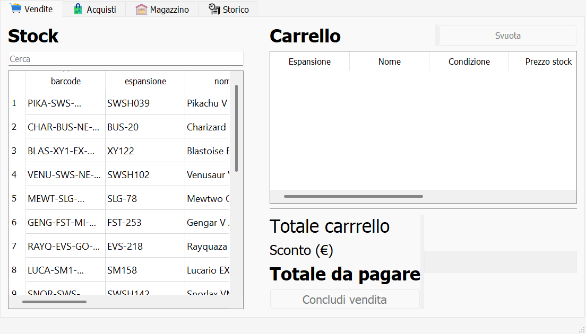
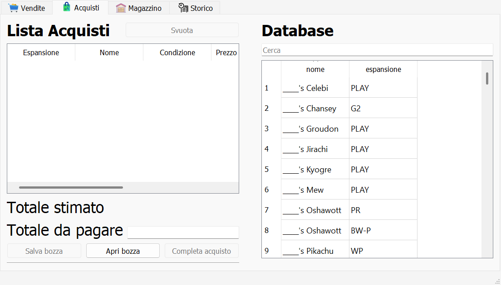
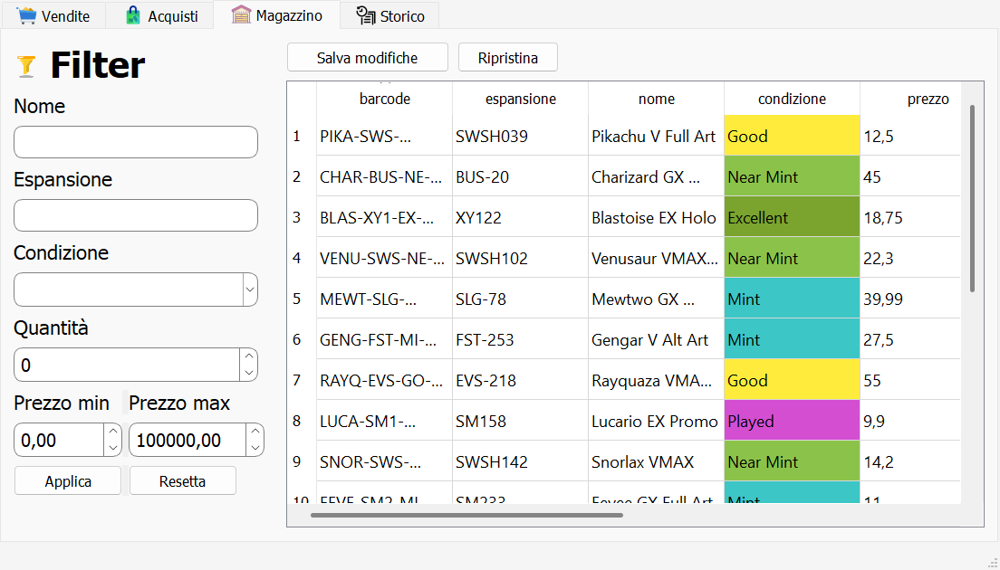
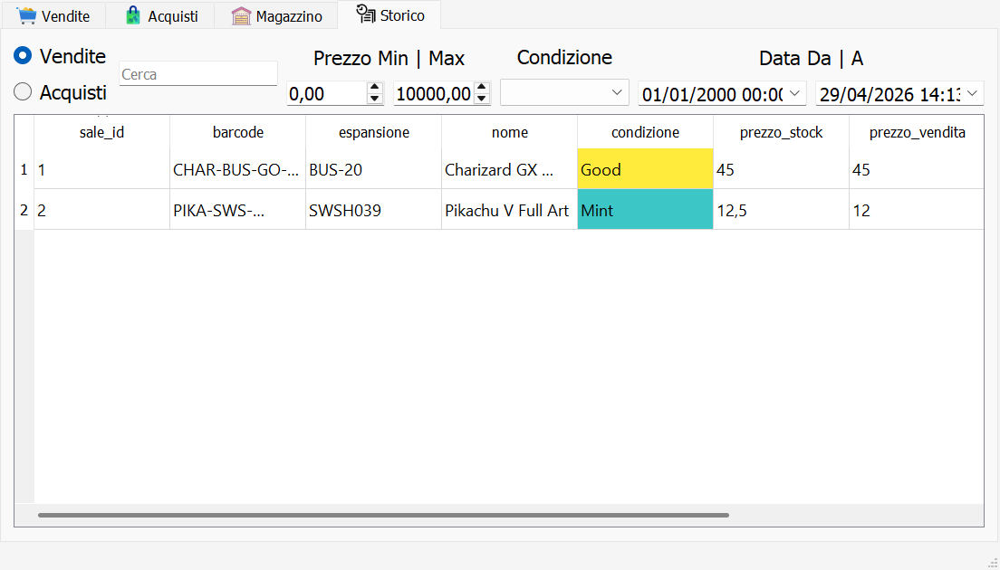

# Pokemon Card Sales Manager

Desktop app in Python + PyQt5 per gestire acquisti, vendite, magazzino e storico di carte Pokemon.

L'applicazione usa un database SQLite locale per lavorare in modo semplice e veloce anche offline, con una UI divisa in tab dedicate alle operazioni quotidiane.

## Panoramica

Pokemon Card Sales Manager nasce per coprire il flusso operativo tipico di un piccolo inventario di carte collezionabili:

- consultazione dello stock disponibile
- inserimento rapido delle vendite con carrello e sconto
- registrazione degli acquisti partendo da un database carte
- gestione del magazzino con filtri, modifica diretta e backup
- consultazione dello storico di vendite e acquisti

## Funzionalita principali

- `Vendite`: ricerca per nome, espansione o barcode, carrello vendita, sconto totale e chiusura transazione.
- `Acquisti`: selezione carte dal database, lista acquisti, calcolo del totale, salvataggio e riapertura di bozze.
- `Magazzino`: filtri per nome, espansione, quantita, condizione e prezzo; modifica diretta dei dati di stock.
- `Storico`: vista filtrabile di vendite e acquisti per testo, condizione, fascia prezzo e intervallo date.
- `Backup`: salvataggio di copie del database prima delle modifiche al magazzino e ripristino del backup piu recente.
- `Bundle desktop`: build eseguibile tramite PyInstaller.

## Stack tecnico

- Python 3
- PyQt5
- SQLite
- pandas
- PyInstaller

## Screenshot

### Vendite



### Acquisti



### Magazzino



### Storico



## Struttura del progetto

```text
.
|-- main.py
|-- config.py
|-- utils.py
|-- requirements.txt
|-- main.ui
|-- style.qss
|-- pokemon.db
|-- card_database.db
|-- tabs/
|   |-- vendite.py
|   |-- acquisti.py
|   |-- magazzino.py
|   `-- storico.py
|-- dialogs/
|-- ui/
|-- icons/
|-- backups/
`-- docs/screenshots/
```

## Avvio in locale

### 1. Clona il repository

```bash
git clone https://github.com/<tuo-utente>/pokemon-card-sales-manager.git
cd pokemon-card-sales-manager
```

### 2. Crea e attiva un virtual environment

Windows PowerShell:

```powershell
python -m venv .venv
.\.venv\Scripts\Activate.ps1
```

### 3. Installa le dipendenze

```bash
pip install -r requirements.txt
```

### 4. Avvia l'applicazione

```bash
python main.py
```

## Build eseguibile

Per generare un eseguibile desktop:

```bash
pyinstaller main.spec
```

## Dati e persistenza

- `pokemon.db`: database principale dell'applicazione.
- `card_database.db`: database di supporto con il catalogo carte.
- `backups/`: contiene i backup automatici del database principale.
- `stock.csv`: file dati utile per import/export o test locali.

## Note utili

- L'app e pensata per uso desktop locale.
- Le risorse vengono risolte correttamente sia in sviluppo sia in bundle PyInstaller.
- Lo stile grafico e centralizzato in `style.qss`.

## Roadmap possibile

- import/export guidato di stock e vendite
- dashboard con metriche e margini
- gestione utenti o profili
- stampa etichette e barcode piu integrata

## Licenza

Questo progetto e distribuito sotto licenza GNU GPL v3.0. Vedi [LICENSE](LICENSE).